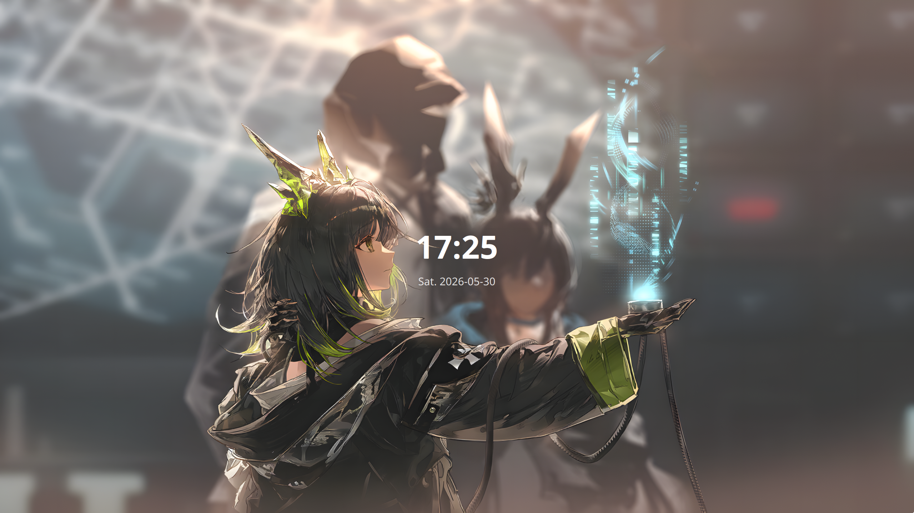
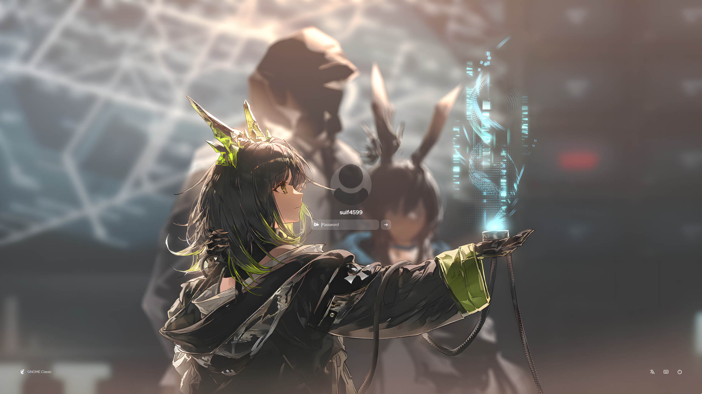

# SilentSDDM - Modified Fork

> [!NOTE]
> This is a modified fork of the original [SilentSDDM](https://github.com/uiriansan/SilentSDDM) by [uiriansan](https://github.com/uiriansan). All credit for the original theme goes to the original author.

## Preview

### Clock Screen


### Login Screen  


## What's Modified

This fork includes a redesigned clock screen inspired by [sddm-anime-tactical](https://github.com/inviter42/sddm-anime-tactical) theme:

- **Clock Display**: Large, clear time and date display with radial gradient background
- **Glass Effect**: Frosted glass appearance with subtle blur and transparency
- **Interaction**: 
  - Click anywhere or press regular keys to enter login screen
  - Smooth fade-out transition (300ms)
  - Whitelist key handling (letters, numbers, Enter, Space, arrows, symbols)
- **Date Format**: "Sat. 2026-05-01" style (weekday abbreviation + ISO date)

## Dependencies

- SDDM ≥ 0.21
- QT ≥ 6.5
- qt6-svg
- qt6-virtualkeyboard
- qt6-multimedia

## Installation

### Install Script

```bash
git clone https://github.com/suif4599/SilentSDDM.git && cd SilentSDDM
./install.sh
```

### Manual Installation

#### Debian/Ubuntu
```bash
sudo apt install sddm qt6-svg-dev qt6-virtualkeyboard-dev qt6-multimedia-dev
```

#### Arch Linux
```bash
sudo pacman -S --needed sddm qt6-svg qt6-virtualkeyboard qt6-multimedia-ffmpeg
```

#### Other Distributions
Install the equivalent packages and follow the manual installation steps below.

### Manual Installation Steps

1. Install dependencies for your distribution
2. Copy theme to `/usr/share/sddm/themes/`:
   ```bash
   sudo mkdir -p /usr/share/sddm/themes/silent
   sudo cp -rf . /usr/share/sddm/themes/silent/
   ```
3. Install fonts:
   ```bash
   sudo cp -r /usr/share/sddm/themes/silent/fonts/* /usr/share/fonts/
   ```
4. Edit `/etc/sddm.conf`:
   ```bash
   sudoedit /etc/sddm.conf
   
   # Add these settings:
   [General]
   InputMethod=qtvirtualkeyboard
   GreeterEnvironment=QML2_IMPORT_PATH=/usr/share/sddm/themes/silent/components/,QT_IM_MODULE=qtvirtualkeyboard
   
   [Theme]
   Current=silent
   ```
5. Test before rebooting:
   ```bash
   cd /usr/share/sddm/themes/silent/
   ./test.sh
   ```

## Original Theme Information

For the full original documentation, customization options, and troubleshooting, please visit:
- [Original Repository](https://github.com/uiriansan/SilentSDDM)
- [Customization Wiki](https://github.com/uiriansan/SilentSDDM/wiki/Customizing)
- [Snippets Page](https://github.com/uiriansan/SilentSDDM/wiki/Snippets)

## Configuration

The original theme supports extensive customization through config files in `./configs/`. To change the active config, edit `./metadata.desktop`:

```bash
ConfigFile=configs/<your_preferred_config>.conf
```

> [!NOTE]
> Changes to the login screen will only take effect when made in `/usr/share/sddm/themes/silent/`.

## Acknowledgements

### Original Theme
- **Author**: [uiriansan](https://github.com/uiriansan)
- **Original Repository**: [SilentSDDM](https://github.com/uiriansan/SilentSDDM)

### Modified Clock Screen
- **Inspired by**: [sddm-anime-tactical](https://github.com/inviter42/sddm-anime-tactical) theme

### Original Credits
- [Keyitdev/sddm-astronaut-theme](https://github.com/Keyitdev/sddm-astronaut-theme): inspiration and code reference
- [Match-Yang/sddm-deepin](https://github.com/Match-Yang/sddm-deepin): inspiration and code reference
- [qt/qtvirtualkeyboard](https://github.com/qt/qtvirtualkeyboard): code reference
- Various artists for background images

---

## License

This modified version follows the same license as the original SilentSDDM theme. Please refer to the [original repository](https://github.com/uiriansan/SilentSDDM) for license information.
